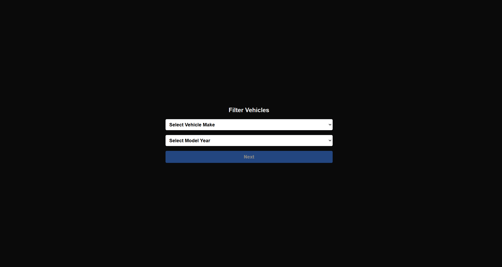

# Project Name: Vehicle Filter Application



## Overview

This is a Next.js application that allows users to filter vehicles by make and model year. It interacts with an external API to fetch vehicle data, and provides an interactive user interface for users to select vehicle makes and model years. The app features dynamic routing to display filtered vehicle results and integrates Suspense for loading state management.

### Features:

- Filter vehicles by make and model year.
- Display a list of vehicle models based on the selected make and year.
- Suspense-based UI for loading states when fetching data.
- Use of environment variables to configure API endpoints.
- Server-side rendering (SSR) for performance optimization.
- Responsively designed interface with TailwindCSS.

## Tech Stack

- **Frontend**: Next.js (React framework)
- **API**: External vehicle data API (fetches makes and models)
- **Styling**: TailwindCSS
- **Routing**: Dynamic routing using Next.js
- **Deployment**: Vercel (Next.js hosting)
- **Environment Variables**: `.env.local` and `.env.production` for configuration

## Requirements

- Node.js (LTS version)
- npm or yarn
- A code editor like VSCode (optional)
- An internet connection for fetching external data

## Setup Instructions

### 1. Clone the Repository

Start by cloning this repository to your local machine:

```bash
git clone https://github.com/xelilovkamran/vehicle-filter-app.git
```

### 2. Navigate to the Directory

```bash
cd vehicle-filter-app
```

### 3. Install Dependencies

Next, install the project dependencies using npm or yarn:

```bash
npm install
# or
yarn install
```

### 4. Start the Development Server

To start the development server, run the following command:

```bash
npm run dev
# or
yarn dev
```

### 5. Build for Production

To build the application for production, run:

```bash
npm run build
# or
yarn build
```

### 6. Run in Production Mode

To run the application in production mode, use:

```bash
npm start
# or
yarn start
```

### 7. Access the Application

Open [http://localhost:3000](http://localhost:3000) to view the application in your browser.

## Application Features

### Vehicle Filter

- The Vehicle Filter form allows users to filter vehicles by make and model year.
- The form consists of two select dropdowns: one for the vehicle make and the other for the model year.
- Users can select a vehicle make from the dropdown list, which is dynamically fetched from the external API.
- The model year is populated dynamically based on the current year (from 2014 to the current year).
- After selecting both make and year, users can click the Next button to view the filtered vehicle results.

### Results Page

- After submitting the form, the app fetches a list of available vehicle models based on the selected make and model year.
- If no models are found, the user will be shown a message indicating no results.
- The list of available models is displayed with basic details such as the model name.

### Loading States with Suspense

- Suspense is used to handle loading states when fetching data for vehicle models. While the data is being fetched, a fallback message is shown to the user, providing a smoother user experience.

## Directory Structure

.
├── components/ # Reusable UI components
│ ├── FilterForm.tsx # Component for the vehicle filter form
│ └── VehicleModels.tsx # Component for displaying vehicle models
├── app/ # Next.js pages
│ ├── page.tsx # Home page with the vehicle filter form
│ ├── layout.tsx # Layout component for the app
│ ├── favicon.ico # App favicon
│ ├── globals.css # Global styles (TailwindCSS)
│ └── result/ # Result pages
│ └── [makeId]/[year] # Dynamic route to show results based on selected make and year
├── public/ # Static assets (images, etc.)
│ └── home.png # Home page image
├── types/ # TypeScript types
│ └── index.d.ts # Custom types for the app
├── .env.local # Local environment variables (not committed to Git)
├── .eslintrc.js # ESLint configuration
├── .prettierrc # Prettier configuration
├── next.config.js # Next.js configuration
├── package.json # Project dependencies and scripts
├── tailwind.config.js # TailwindCSS configuration
├── postcss.config.js # PostCSS configuration
├── tsconfig.json # TypeScript configuration
└── README.md # Project documentation (this file)

## Deployment

The application is deployed using Vercel, which provides a seamless deployment experience for Next.js applications. You can check out the live demo of the application from [here](https://vehicle-filter-app.vercel.app/).
